# Power Apps Architecture & UI Specification

The application follows a modular six screen layout designed for mobile devices, fully responsive, and styled using custom theme variables.

## Global UI, Users & Theme Setup
Defined globally in `App.OnStart` for consistent styling and defining user across all components:

```powerfx
//User displayed on every page on the Top Header
Set(gblUserFullName, User().FullName);
Set(gblUserEmail, User().Email);
Set(gblUserImage, User().Image);

Set(
    AppTheme,
    {
        InputText: ColorValue("#F5DEB3"),
        InputFill: ColorValue("#141414"),
        BorderColor: ColorValue("#FFA500"),
        PrimaryOrange: ColorValue("#FFA500")
    }
)
```

## Pages structure and Tree views
The application is structured logically into distinct screens, components, and containers to ensure clean hierarchy, modularity, and seamless navigation.

Below is the complete breakdown of the **Tree View** structure:

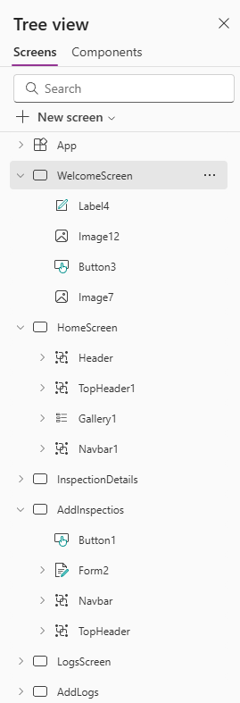

## Screen Breakdown 

### 1.`WelcomeScreen`

* Landing interface for application start and it appears only the first time when the app is opened.
* Logic: ```Navigate(HomeScreen, ScreenTransition.Fade)```

 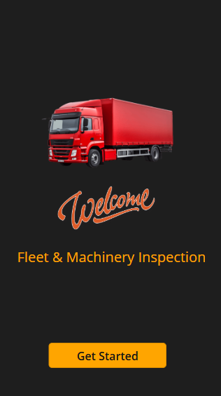

 ### 2.`HomeScreen`

* Primary gallery dashboard listing all fleet vehic
* Features:

  * Dynamic Filtering: Dropdown control allowing filtering by vehicle status (All, Completed, In progress, Not started, Failed).

  * Status Indicators: Circle components displaying color-coded status using Switch() evaluation.

* Gallery Items Logic with filtering:
```powerfx
If(
    Dropdown1.Selected.Value = "All",
    FleetVehicles,
    Filter(FleetVehicles, Status.Value = Dropdown1.Selected.Value)
)
```
* Color logic for the Inspection Status:
```powerfx
Switch(
    ThisItem.Status.Value,
    "Completed", Color.Green,
    "In progress", Color.Orange,
    "Failed", Color.Red,
    Color.LightBlue
)
```

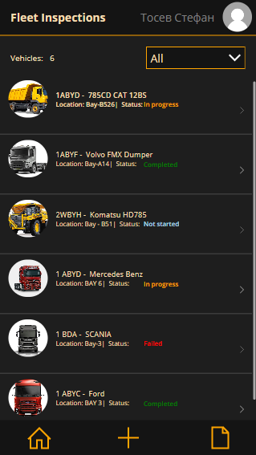

### 3.`InspectionDetails`

* Full inspection detail view and record deletion.
* Features:
    * Example text and logic of a selected inspection: `"Model: " & " " & Gallery1.Selected.Model`
    * Delete Modal: 
    ```powerfx
    Remove(FleetVehicles, Gallery1.Selected);
    Notify("Succesfully deleted", NotificationType.Success);
    Navigate(HomeScreen, ScreenTransition.CoverRight)
    ```
    * * Edit button opens the Edit page with completed data of the selected inspection

    * Modal Logic: Controlled via ```UpdateContext({locShowConfirmDelete: true})```.

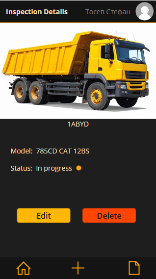

### 4.`Add/Edit Inspections`

* Dual-mode Edit Form (FormMode.New and FormMode.Edit) for submitting logs. 
* Form submission triggers SubmitForm(Form1) with inline validation checks.
* Form data source is the Gallery1 items (FleetInspections table)
* Submit Button Logic:
```powerfx
    SubmitForm(Form2);
    Notify("Succesfully saved!",         NotificationType.Success);
    ResetForm(Form2);
    Navigate(HomeScreen, ScreenTransition.CoverRight);
```

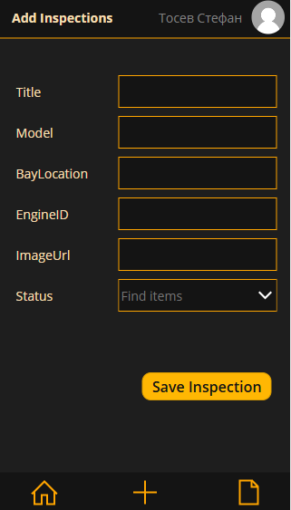

### 5.`LogsScreen`

* Historical log repository displaying all completed and pending inspection reports in a Horizontal gallery.
* Renders records from the `InspectionLogs` SharePoint list.
* Features the Edit and Delete button for each Log.

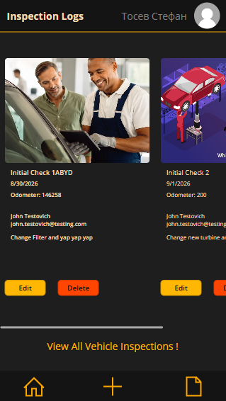

### 6.`Add/Edit Logs`

* Entry screen for submitting new inspection logs or editing existing report entries.
* Shares the exact same architecture and form logic as the `AddInspectios` screen (`FormMode.New` and `FormMode.Edit`).
* Uses `SubmitForm()` to save inspection entries directly to the `InspectionLogs` list, triggering the automated Power Automate email notification flow upon creation.

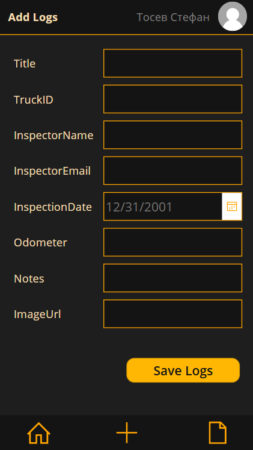

## Power Automate Integrations

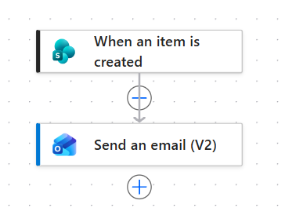

* Triggers When an item is created in SharePoint (or PowerApps submit on a new item) to send an Outlook HTML email notification with asset details and image preview to the user (my email for testing).

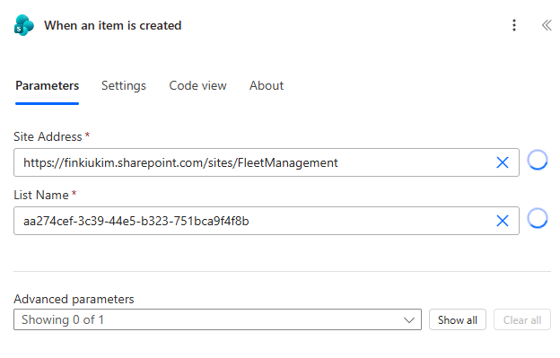
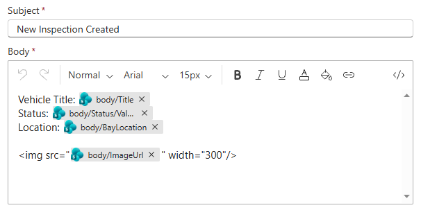

* Confirmation that the email arrives and the flow is active

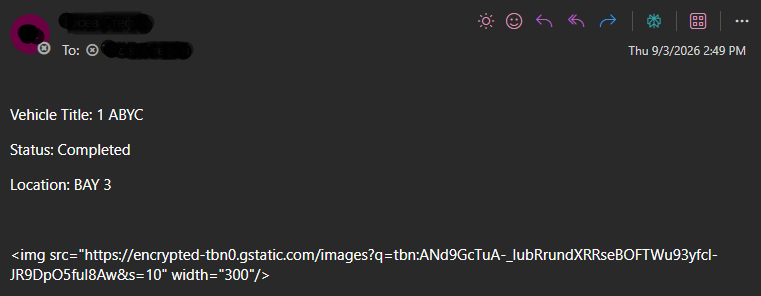