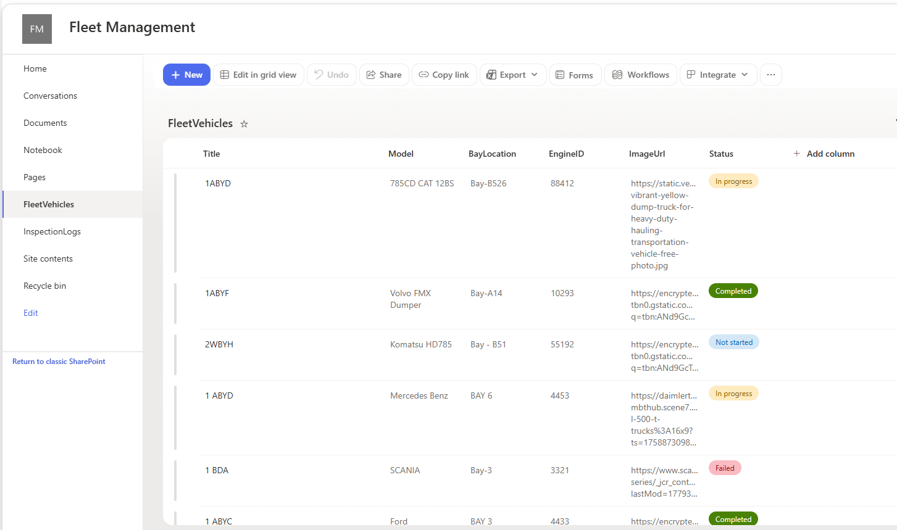
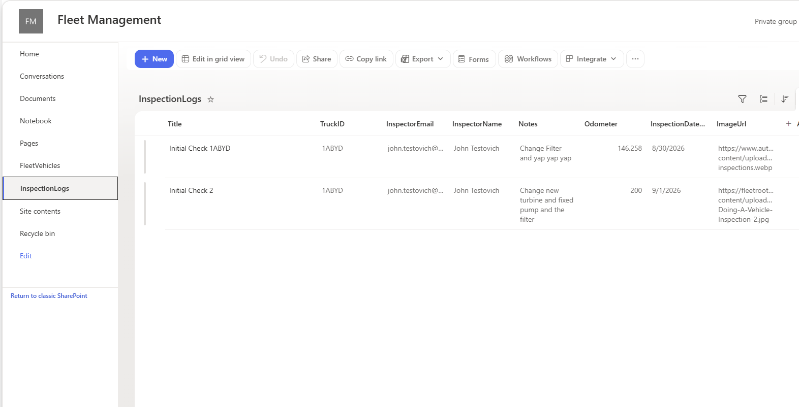

# SharePoint Data Architecture & Configuration 

This project utilizes two relational SharePoint Lists to store asset master data and historical inspection logs.

## Entity Relationship Diagram
* **`FleetVehicles`** (Master List): Contains asset metadata, location, and operational readiness.
* **`InspectionLogs`** (Child List): Tracks individual safety inspection submissions linked via `TruckID`.

## List Schemas
### 1.`FleetVehicles` List
| Field Name | Type | Description |
| :--- | :--- | :--- |
| `Title` | Single line of text | Vehicle Identification / Plate ID |
| `Model` | Single line of text | Vehicle Make & Model |
| `BayLocation` | Single line of text | Assigned maintenance bay / depot |
| `EngineID` | Single line of text | Serial number of the engine |
| `ImageUrl` | Single line of text | External URL link to asset photo |
| `Status` | Choice | Status: `Completed`, `In progress`, `Not started`, `Failed` |

### 2. `InspectionLogs` List
| Field Name | Type | Description |
| :--- | :--- | :--- |
| `Title` | Single line of text | Log summary or title |
| `TruckID` | Single line of text | Foreign Key matching `FleetVehicles.Title` |
| `InspectorName` | Single line of text | Full name of inspecting technician |
| `InspectorEmail` | Single line of text | Email address for notifications |
| `InspectionDate` | Date & Time | Date when inspection took place |
| `Odometer` | Number | Current mileage / engine hours |
| `Notes` | Multiple lines of text | Detailed inspection comments |
| `ImageUrl` | Single line of text | Attachment photo URL |

## Data Connection & Integration
* Both lists were connected directly into Power Apps using the native **SharePoint Connector**.
* CRUD operations interact natively through `SubmitForm()`, `Patch()`, and `Remove()` Power Fx expressions.